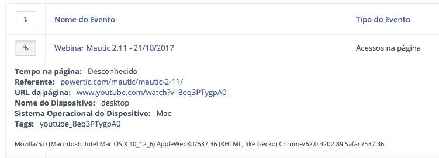

# mautic-youtube-logger

Register Youtube plays on Mautic

### Download Wordpress Plugin

You can download the latest version o Mautic Youtube Logger Plugin here:

[Download Plugin](https://github.com/powerticmkt/mautic-youtube-logger/archive/master.zip)

Install on the same way you install any Wordpress plugin ;)

### Using the Shortcode

This plugin provides a simple shortcode where you pass 3 parameters:

-`videoId`: The youtube Video ID.

So the ID is NpEaa2P7qZI on this URL: https://www.youtube.com/embed/NpEaa2P7qZI?enablejsapi=1

-`mauticUrl`: Full URL of your mautic

-`height`: Height in pixels of Youtube Player

So you can use this shortcode:

`[mautic_youtube videoId="NpEaa2P7qZI" mauticUrl="https://mkt.powertic.com"]`

The height params is optional with "500px" default value.

### How it Works

This script tracks youtube plays and logs to Mautic Pixel Tracking with:

- Video ID
- Video URL
- Video Title

Also add a tag with videoID suffixed with "_end" if lead watch entire video:

`youtube_NpEaa2P7qZI` for who watched `NpEaa2P7qZI` video

`youtube_NpEaa2P7qZI_end` for who watched `NpEaa2P7qZI` until end

### See Mautic Lead Timeline entry

